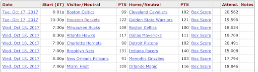

```{r setup, include=FALSE}
knitr::opts_chunk$set(echo = TRUE, warning = FALSE, message = FALSE)
```
```{r}
library(tidyverse)
library(dplyr)
library(ggplot2)
require(scales)
```

### 1. Introduction

The link to the repository is: https://github.com/jzhng123/Fall-18-EDAV-proj

Are you a fan of NBA? If the answer is yes, watching an NBA game would be a great enjoyment for you. However, if you are not as rich as Michael Jordan, sometimes you are concerned that which team's games are more popular than others' because that may impact how much more money you need to pay for your tickets. To help people understand why a team's games are popular, the project team is going to pull out data from reliable resources to help you find out the underlying factors. 

One of the most important features to judge a game's popularity is its attendance rate. Therefore, in this project,  the project uses the attendance rate to define the popularity of the game. That is, a game is more popular if and only if its attendance rate is higher. To understand the factors that are affecting a game's popularity, the project team choose to visualize the relationship between the attendance rate and various factors. The factors the project team decides to analyze: local population, the number of fans, the team's win ratio. 


### 2.Description of data
The project team has retrieved some interesting data from BASKETBALL reference to visualize the attendance of NBA games. The data sets on which we are working are:

1.NBA Attendance Report
The attendance report on ESPN provides data on the attendance of all the NBA teams. It has the attendance records for all NBA games, and the attendance data is classified by home/away. Primary key: team name

2.The population of the NBA team's city 
The project team has done research on the population of each city and has compiled this file. The file gave the population of the city when the game took place. Primary key: the team's location

3.Fans of the team
The number of fans for each NBA team.  Primary key: team name

4.The win ratio of the team. Primary key: team name
The locations of all the 29 arenas
There are 30 NBA teams in total but there are only 29 arenas, the LA Lakers and the LA Clippers share an arena. Google map provides the latitude and longitude of each arena. Primary key: the team's location


### 3. Analysis of data quality and data cleaning

Basketball-Reference.com is a professional private company providing a wide range of basketball player, team and game data. We extracted the individual games data for the 2017-2018 season. A peek of the table is provided in the following figure. 


The table consists of 7 useful columns, the game date, the start time, visitor and home teams and their scores, as well as the attendance of the game. For this report, we are going to focus on only three columns, the visitor team, the home team, and the attendance. Since there are a total of 30 teams and each team plays 82 games in the regular season, there are 82*30/2 = 1230 rows. 
There are still some anomalies that draw the project team's attention in the table above, although the dataset has good qualities in general. Some game locations are not in any of the NBA team's arena. The project team then researches on the bizarre locations and founds out that the NBA sometimes set up matches overseas to expand its global market. In this case, the project team simply drops out those unusual data because it does not make sense to analyze the attendance for the arena that only has had one NBA game.

Since different arenas have different capacities, it is thus not wise to do analysis on the attendance directly. The team wants to know the percentage attendance (attendance / arena capacity) for each game, so capacities for all 30 arenas are gathered. Furthermore, the team wants to explore the relation between attendance and several factors, including fans population, city population, and team performance. The reasons why the team is choosing these factors are discussed in the following sections. These data are also hand gathered. Since there are only 30 teams, it's only 90 entries of data, which doesn't require a lot of time. 

With the capacities, the team was able to calculate the attendance percentage (percent of occupied seats) for each individual game. With the average attendance percentage for each team, the team carried on to the analysis stage. 


### 4. Main analysis (Exploratory Data Analysis)

The project team first takes a look at the big picture of the differences in each NBA team's average attendance rate to ensure that the distribution is interesting enough to perform the analysis. Considering that there are 30 NBA teams in total, the project team uses the Cleveland plot to visualize the distribution. 

```{r}
nba <- read.csv(file="nba2.csv", header=TRUE, sep=",", na.strings=c(" ","NA"))
names(nba)[1]<- "X"
theme_dotplot <- theme_bw(14) +
    theme(axis.text.y = element_text(size = rel(.75)),
    	axis.ticks.y = element_blank(),
        axis.title.x = element_text(size = rel(.75)),
        panel.grid.major.x = element_blank(),
        panel.grid.major.y = element_line(size = 0.5),
        panel.grid.minor.x = element_blank())
ggplot(nba, aes(x = attendance, y = reorder(X, attendance))) +
    geom_point(color = "blue") + theme_dotplot + xlab("Average attendance rate per Game") + ylab("Team")+xlim(0,1) + ggtitle("Average vacancy rate per Game v.s. Team")

```

From the Cleveland plot above, the project team found out that the approach of plotting attendance rate does not quite work because generally speaking NBA teams are very popular and the difference among their average attendance rate is subtle. Therefore, the project team chooses to plot the average vacancy rate instead.

```{r}
ggplot(nba, aes(x = percent_empty, y = reorder(X, percent_empty))) +
    geom_point(color = "blue") + theme_dotplot + xlab("Average vacancy rate per Game") + ylab("Team")+ggtitle("Average vacancy rate per Game v.s. Team")


```


Since the team acquired the data for all games, we also plotted the vacancy rate when the teams are on the road. Although it is not as relevant as analyzing the vacancy rate at home games (has more business impact), we can get a general sense on which of the teams are more popular. It is during their visits that the fans are willing to pay for the tickets. Upon initial speculation, the team ascribes the popularity of the teams with low vacancy rate to the superstar players on their teams. The visiting teams with the highest attendance, Cavaliers, Warriors, and Thunder, all have one or several superstars on their teams. However, the team doesn't see a consistent scale in the two Cleveland dot plots. Therefore, the team would like to combine the data into the same dot plot. 

#### 4.1 Local population v.s. Average attendance rate 
The first potential factor the project team decides to look over is each team's local population. The project team anticipates that the larger the population, the higher the average attendance rate for the team. For the initial analysis, the project team plotted a scatter plot of Local population v.s. Average attendance rate.

```{r}
ggplot(nba, aes(x=population, y=percent_empty)) + geom_point()+ ggtitle("Population v.s. Average vacancy rate")+ylab("Vacancy rate") + theme_bw(14)
```

However, from this initial plot, the project team did not find any patterns. To help the audience visualize the relationship, the project team will introduce the radius map in the executive summary part.

#### 4.2 Number of fans v.s. Average attendance rate 
The project team then wants to know if there is a relationship between the number of fans and the average attendance rate. Our common sense tells us that more fans a team has, the more popular its games. The scatter plot for the initial analysis is then plotted as below.

```{r}
ggplot(nba, aes(x=fans, y=percent_empty)) + geom_point()+ggtitle("Number of fans v.s. average vacancy rate") + xlab("Number of fans")+ ylab("Vacancy rate") + theme_bw(14)

```

From the graph, we see that there is a negative correlation between the number of fans of the team and the team's average vacancy rate. That means, generally speaking, more fans a team has, larger attendance rate it will have on average.


#### 4.3 Win ratio of the team v.s. Average attendance rate 
The project team is now interested in the relationship between the win ratio of the team and its average attendance rate. 

```{r}
ggplot(nba, aes(x=win_percentage, y=percent_empty)) + geom_point()+ggtitle("Win rate v.s. average home game vacancy rate")+xlab("Win rate")+ylab("Vacancy rate") + theme_bw(14)
```

Again, no clear patterns have been identified.

#### 4.4 Attendance rate changes over time.
The variable of interest is `Attendance` (attendance rate per game) in 2017. We want to visualize the change of attendance rates over time and their possible effect on the home teams. 

```{r}
data = read.csv(file = "nba.csv")
colnames(data) = c("Date","Start (ET)",	"Visitor/Neutral",	"PTS",	"Home/Neutral","PTS.1",	"Attend."	,"Capacity",	"Attendence")
df = data %>% 
  mutate(Date = as.Date(as.character(Date), format = "%a, %b %d, %Y")) %>%
  select(Date, Attend = Attendence, HomePTS = PTS.1)
```

Compute the daily average of attendance rates and final points of the home teams.

```{r}
df1 = aggregate(Attend ~ Date, df, mean)
df2 = aggregate(HomePTS ~ Date, df, mean)
df3 <- merge(df1, df2, by = c("Date"), all=TRUE)
colnames(df3) = c("Date", "Attend", "HomePTS")
write.csv(df3, file = "attend.csv")

```

```{r}
ggplot(df, aes(x=Attend)) + geom_histogram()+ggtitle("Histogram of the Attendance rate")+xlab("Attendance rate") + theme_bw(14)
```

From the graph, patterns are identified, and the summary of the findings will be presented in the executive summary section.

#### 4.5 Correlation analysis
At this point, the project team wants to determine that if there are any correlations between each pair of factors we are analyzing. Therefore, the project team builds the correlation matrix as below. 

```{r}
corr_data = read.csv(file = "corr.csv")
plot(corr_data[, 3:5])
```

From the correlation matrix, no clear patterns have been identified.

### 5. Executive summary 

The project team has created an interactive Cleaveland dot plot fo show the distribution of the target value----Average vacancy rates. By our definition in the introduction, a lower average vacancy means the corresponding NBA team is more popular.

```{r, echo = FALSE}
nba_tidy <- read.csv(file="nba_tidy.csv", header=TRUE, sep=",", na.strings=c(" ","NA"))
Team <- fct_reorder2(nba_tidy$team, nba_tidy$Game, -nba_tidy$vacancy_rate)
g <- ggplot(nba_tidy, aes(x = vacancy_rate, y = Team, color = Game)) + 
    geom_point() + xlab("Average Vacancy Rate") + ylab("") + theme_dotplot + ggtitle("Home and Away Empty Seat Percentage by Team")
##
library(plotly)
ggplotly(g)
```

The team combined the home and away vacancy rate data into one Cleveland dot plot and made it interactive. By hovering over the mouse, one could see the team, whether the data is of home or away games, and the average vacancy rate. It gives a much clearer view, showing the data on a consistent scale. One could see that the away vacancy rate has a smaller range than the home vacancy rate. It is easy to understand because the attendance for the same team is relatively consistent, but when they are on the road, visiting other teams, the market is entirely different, so the range is much smaller. Teams with both high attendance at home and away games usually have superstars and are high in standings. The team is also interested in those teams with a high difference in the house and away vacancy rate. For example, Sacramento Kings and Dallas Mavericks had excellent attendance at home games but failed to maintain that attendance rate when they are on the road. Both of these teams are bad regarding performance but are known for their vast and fanatic fanbase.


First, we look at the relationship between the local population and the average attendance rate. Mouse over the blue circles below to see which team it represents.

Attendance Rate Radius Map

```{r, echo=FALSE}
library(leaflet)
library(leaflet.extras)
library(htmlwidgets)
arena <- read.csv("Arena.csv")
colnames(arena) = c("City","Lat",	"Long",	"Empty",	"Attend")
interactive_arena = leaflet(arena) %>% addTiles() %>%
  addCircles(lng = ~Long, lat = ~Lat, weight = 1,
             radius = ~Attend*Attend*Attend*Attend * 100000, label = ~City, group ='cities') %>%
  addDrawToolbar(
    targetGroup='cities',
    editOptions = editToolbarOptions(selectedPathOptions = selectedPathOptions()))  %>%
  addLayersControl(overlayGroups = c('cities'), options =
                     layersControlOptions(collapsed=FALSE)) %>%
  addStyleEditor()
#saveWidget(interactive_arena, file="interactive_arena.html")
interactive_arena
```

Population Radius Map

```{r, echo=FALSE}
Pop <- read.csv("Pop.csv")
colnames(Pop) = c("City","Lat",	"Long",	"Population")
interactive_pop = leaflet(Pop) %>% addTiles() %>%
  addCircles(lng = ~Long, lat = ~Lat, weight = 1,
             radius = ~sqrt(as.numeric(Population)) * 40000, label = ~City, group ='cities') %>%
  addDrawToolbar(
    targetGroup='cities',
    editOptions = editToolbarOptions(selectedPathOptions = selectedPathOptions()))  %>%
  addLayersControl(overlayGroups = c('cities'), options =
                     layersControlOptions(collapsed=FALSE)) %>%
  addStyleEditor()
#saveWidget(interactive_pop, file="interactive_pop.html")
interactive_pop
```

In the attendance rate radius map, the radius stands for the percentage of attendance rate. While in the population radius map, the radius is determined by the population of the team's city. In the preliminary radius map, our team tries to use the raw attendance percentage to plot circles on the map. However, as discussed above, the attendance rates have little difference among the best and the worst teams. Our team scales the percentage to reflect the variation of attendance rate better. Similarly, we make appropriate adjustments to the population data so that we can visualize the difference clearly in the map. 

There is no significant correlation between the population of the team's city and the attendance rate. There are small cities with relatively high attendance rates while large cities with relatively low attendance rates. We have several possible assumptions. No matter how small a town might be, compared to the size of the arena(usually around 18000 seats), the population is big enough. Thus, the population will not make a huge difference. 


Is an NBA team more popular when it has more fans? The answer is probably yes. 

```{r, echo=FALSE}
ggplot(nba, aes(x=fans, y=percent_empty)) + geom_point()+ggtitle("Number of fans v.s. average vacancy rate") + xlab("Number of fans")+ ylab("Vacancy rate") + theme_bw(14)

```

From the above graph, as the number of fans increase, the average vacancy rate decreases. Therefore, it is true that an NBA team is more popular when it has more fans.

Some people believe that if a team wins more game, that team's home games are more likly to be more popular. The project team has prepared a scatter plot.

```{r, echo=FALSE}
ggplot(nba, aes(x=win_percentage, y=percent_empty)) + geom_point()+ ggtitle("Win rate v.s. average home game vacancy rate")+xlab("Win rate")+ylab("Vacancy rate") + theme_bw(14)
```

From the above plot, we do not see any patterns between the win rate and the average home game vacancy rate. Therefore we can conclude that if a team wins more game, the team's home games are not necessarily more likely to be more popular.

Next, We want to visualize the change of attendance rates over time and their possible effect on the home teams.

```{r, echo=FALSE}
htmltools::includeHTML("Attd_over_Time.html")
```

This figure presents dynamically the change of daily average attendance rates and the corresponding average points over time.

According to the previous finding, it is rare to observe a low attendance rate. Hence, we propose that a distinctively lower-than-majority attendance rate is possible to affect the performance of home teams negatively. In other words, the average score is expected to behave in a similar pattern to the average attendance rate. 

In this figure, the red line presents the change in average attendance rates, and the blue line shows the evolution of the average points of the home teams. 

If moving the mouse over a specific data point, exact quantities will be shown.
After investigating the figure, the most prominently low attendance rates indeed correspond to low average points. However, there seems no significant correlation between high attendance rates and average scores. High attendance rates can be paired with high points and also with shallow points. 

Therefore, it is concluded that the low attendance rate will negatively affect teams' performance while high attendance rate does not have much effect on performance. 

### 6 Conclusion
 In this project, the team chooses some possible attributes to use exploratory methods checking whether if they can impact an NBA team's games' popularity on average. The potential factors are local population, a number of the fans of the team, win rate of the team. The project team has concluded that among those attributes, only the number of fans of the team can obviously impact the team's popularity ----- an NBA team more popular when it has more fans. The project team has also concluded that a significantly low attendance rate is likely to have negative effect on teams' performance; while high (above 90 percent) attendance rate does not have much effect on performance.
